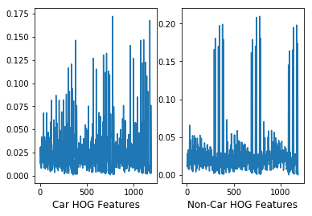
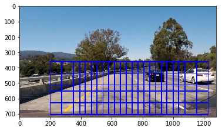

# Vehicle Detection
[](http://www.udacity.com/drive)

The goals / steps of this project are the following:

* Perform a Histogram of Oriented Gradients (HOG) feature extraction on a labeled training set of images and train a classifier Linear SVM classifier
* Optionally, you can also apply a color transform and append binned color features, as well as histograms of color, to your HOG feature vector. 
* Normalize the features and randomize a selection for training and testing.
* Implement a sliding-window technique and use your trained classifier to search for vehicles in images.
* Run the pipeline on a video stream (start with the test_video.mp4 and later implement on full project_video.mp4) and create a heat map of recurring detections frame by frame to reject outliers and follow detected vehicles.
* Estimate a bounding box for vehicles detected.

## [Rubric](https://review.udacity.com/#!/rubrics/513/view) Points


### 1 Pipeline Description
The Vehicle Detection pipeline is described in this section:
* A Feature_extractor class is defined which can extract the features as per configuration provided in an input image. An instance of this class is used everywhere in the pipeline as well as during testing and visualization to maintain consistency.
* A Car_Finder class is used to do the following
    * Create Multi Scale Windows
    * Search for cars in the input image using the multi scale windows
    * Create the prediction vector and heatmap using search output
    * Use the history of heatmaps to make one consolidated heatmap
    * Threshold the consolidated heatmap to create labels
    * Draw the label bounding boxes
    * Returning the Annotated image
    
* A LinearSVC from sklearn has been used. The tuning table of the C parameter is provided in later sections

### 2 Training Data
The standard training data provided in the project materials has been used to train the Classifier mentioned in the pipeline. Examples of Car and non Car images are shown below.


### 3 Feature Exploration
A Class called Feature_extractor was defined which is capable of extracting Spatial, Histogram as well as Hog features for an input image. This class is configured for various different features and the Concatenated feature output was plotted for visualization. Examples of such plots are provided below





Various combinations were tried and the observations are enumerated below:
* Histogram features were consistently similar for Car and Non Car Images
* Spatial Features' plots increased in similarity on increase in spatial_size parameter
* HOG Yielded best results in YUV colorspace with 11 Orientation bins
* Combination of Spatial and HOG features resulted in a superior classifier to using pure HOG features

### 4 Classifier Training

A Linear SVC was used to train over the entire set of Normalized Features for cars and non cars. Data was split using sklearn into training and validation sets. The C parameter was tuned empirically
Accuracy observations are Enumerated below
* ||Features: Spatial + Hog||
* Classifier: LinearSVC
* C:default, Accuracy: 95.67
* C:0.1, Accuracy: 96.6
* C:0.01, Accuracy: 97.05
* C:0.001, Accuracy: 97.94 


### 5 Finding Cars
A Class called Car_finder has been defined in code. Objects of the feature extractor used to train and the X scaler and the trained classifier are passed to the Car finder class as arguments upon instantiation. 

#### 5.1 Creating multi scale windows for searching
This class creates various multi scale windows and initializes its own windows attribute. This attributes value will be used to search for incoming frames.

##### 5.1.1 Sliding windows
The Sliding window algorithm describes the approach of searching through an input image by dividing it into sub regions called ROIs (Regions of Image/Interest) and searching through them. The approach is specifically suited for multi scale object detection.
Sliding window detectors find objects in the following steps: 
* inspect every window
* extract features in window
* classify & accept window if positive
* optional: A classifier score threshold can also be applied to only take in high confidence classifications

##### 5.1.2 Sliding windows in this project
The underlying assumption is that objects(vehicle) that are close and relevant will be spread in a wider area and occupy a larger region of the image while objects that are further away will be smaller in size and be spread over a narrower region as a possibility.
Three combinations were chosen empirically to account for the assumption described above. A Visual representation of the sliding windows is described above.




#### 5.2 Searching for Cars
Iterating through the windows attribute initialized in the previous step, the input image was cropped by search window, resized to 64x64. The feature extractor was used to extract the features and pass it on to the trained classifier. The predictions were concatenated into a 1D array and returned. The find_raw function in the class source code is responsible for this. The windows with the respective indices that return positive values are used to find the detection vertices.


#### 5.3 Creating and thresholding the Heatmap
The Heatmap was created by incrementing all the pixel values in positive detection windows.

Threshold was empirically tuned to a value of 2 to remove false positives.

** Smoothing filter for tracking **
An Aggregation of the last 6 heatmaps is taken and the threshold is applied to this aggregation. The underlying assumption is that False positives will be sporadic in nature while the Relative positions of vehicles on the road with respect to the camera will not move by a lot and will reinforce the heatmaps by subsequent positive detections.
The number of frames and the threshold value are determined empirically

#### 5.4 Extracting the final bounding boxes
The label function was used to extract the final bounding boxes on the image.


### 6 Processing Video Frames
Since I used a class based approach for My Software elements, Deploying the pipeline for video detection was quite simple. The video is provided as project_video_out.avi in the repository.

### 7 Discussion
* Since I used a class based approach for Code reusability, I was unable to integrate the performance optimizations as discussed in the Lesson materials. For Feature extractions, I pretty much wrapped the functions provided in the lesson_functions.py file provided in the study materials into my code. I do want to improve performance by implementing the hog feature finding optimizations into my class. I also want to use multiple threads to process several multiscale windows simultaneously.
* Since the detection pipeline is dependent on Spatial and Hog Features, the Differnce between the background and the Vehicle region plays a key role in true or false detections. I would like to include wavelet as well as some other frequency space feature explorations in my future work in this direction


```python

```
